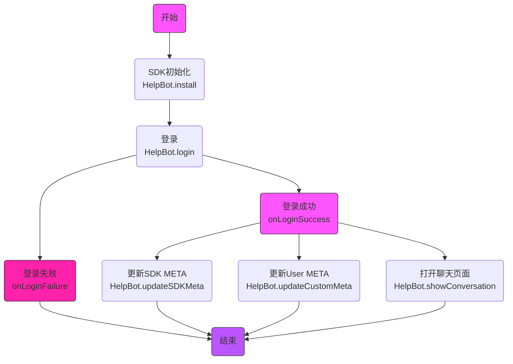
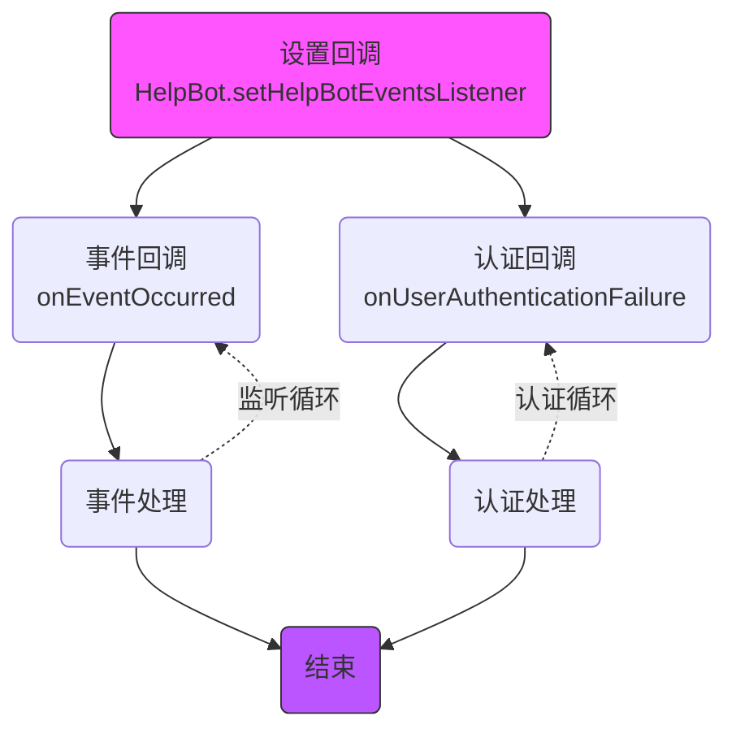

## 1. 概述

HelpBot SDK是一个基于WebView的组件库，用于各平台应用中集成HelpBot客服功能。该SDK提供了一套完整的API，允许开发者快速集成客服对话、FAQ查看、用户身份验证等功能。

## 2. 项目结构

### 2.1 主要模块

1. **app** - SDK使用示例和演示应用
2. **HelpBot** - SDK核心库

### 2.2 核心组件

- `HelpBot` - SDK主入口类，提供所有公共API
- `HelpBotContext` - SDK上下文管理，维护全局状态
- `HelpBotActivity` - WebView容器Activity，展示客服界面
- `EventProxy` - 事件代理，处理SDK事件回调
- `Logger` - 日志模块，用于输出所有SDK日志
- `Storeage` - 应用存储，处理各类数据的长期存储
- `Thread` - 线程管理，包装各类执行

## 3. 功能需求

### 3.1 核心功能

#### 3.1.1 SDK初始化

`HelpBot.install(Activity applacation, Sring ChannelID, String Domain, Map<String, Object> configMap)`

- 提供[install](file:///F:/Android/Project/sdk_webview_test/lib_helpbot/src/main/java/com/example/sdk_view/HelpBot.java#L77-L113)方法用于初始化SDK
- 需要传入Context、channelId、domain和配置参数
- 支持FULL_PRIVACY_MODE隐私模式配置

#### 3.1.2 用户登录认证

`HelpBot.login(String identitiesJWT, Map<String, Object> loginConfig, HelpBotUserLoginEventsListener userLoginEventsListener)`

- 提供[login](file:///F:/Android/Project/sdk_webview_test/lib_helpbot/src/main/java/com/example/sdk_view/HelpBot.java#L121-L124)方法进行用户身份验证
- 需要客户使用同方法计算JWT令牌，密钥在网站后台获取

```
//  Step 1: Get the JWT and and login config like full privacy flag.
String identitiesJWT = "<Your JWT token for identities>";
Map<String, Object> loginConfig = new HashMap<>();
loginConfig.put("fullPrivacyMode", false);

// Step 2: Call the loginWithIdentity API.
HelpBot.login(identitiesJWT, loginConfig, new HelpBotUserLoginEventsListener() {
    @Override
    public void onLoginSuccess() {
        // Step 3:  Handle login success.
        Log.d(TAG, "onLoginSuccess: ");
    }

    @Override
    public void onLoginFailure(String userLoginFailureReason, Map<String, String> map) {
        // Step 4: Handle login failure. The reason and errors parameters
        // provide more information on what exactly failed.
        Log.d(TAG, "onLoginFailure: Login failed with reason " + userLoginFailureReason + ", errorData " + map);
    }
});

```

#### 3.1.3 会话展示

`HelpBot.showConversation(Activity a, Map<String, Object> configMap);`

- 显示客服对话界面
- 使用WebView加载远程客服页面

#### 3.1.4 FAQ功能(未完)

* 暂未完成页面，直接显示带参数网址即可(https://www.baidu.com/?tn=68018901_16_pg)
* tn 为可变参数

`HelpBot.showFAQs(Activity a, Map<String, Object> configMap);`

`HelpBot.showFAQSection(Activity a, String sectionPublishId, Map<String, Object> configMap);`

`HelpBot.showSingleFAQ(Activity a, String questionPublishId, Map<String, Object> configMap);`

- [showFAQs](file:///F:/Android/Project/sdk_webview_test/lib_helpbot/src/main/java/com/example/sdk_view/HelpBot.java#L127-L130) - 显示FAQ主页面
- [showFAQSection](file:///F:/Android/Project/sdk_webview_test/lib_helpbot/src/main/java/com/example/sdk_view/HelpBot.java#L134-L137) - 显示特定FAQ分组
- [showSingleFAQ](file:///F:/Android/Project/sdk_webview_test/lib_helpbot/src/main/java/com/example/sdk_view/HelpBot.java#L141-L144) - 显示单个FAQ页面

#### 3.1.5 数据更新

`HelpBot.updateSDKMeta(Map<String, Object> sdkMeta);`

* 更新系统类信息，如手机电量、充电状态、网络情况、系统版本等。

`HelpBot.updateCustomMeta(Map<String, Object> customMeta);`

* 更新用户自定义信息

#### 3.1.6 事件监听

`HelpBot.setHelpshiftEventsListener();`

* 设置事件监听器 - 用户与SDK信息交互处理。
* 支持会话事件和认证失败事件回调

```
HelpBot.setHelpBotEventsListener(new HelpBotEventsListener() {
 @Override
 public void onEventOccurred(@NonNull String eventName, Map<String, Object> data) {
   switch(eventName){
     case HelpBotEvent.CONVERSATION_START:
       // 实现代码
     break;
       // 其余event
   }
 }

 @Override
 public void onUserAuthenticationFailure(HelpBotAuthenticationFailureReason reason) {
   // your code here
 }
});
```

##### 3.1.6.1 事件类型

| 方法                     | 类型 | 说明                                |
| ------------------------ | ---- | ----------------------------------- |
| sendEvent                | 外部 | 用于帮助用户介入各类流程的事件通知  |
| sendUserAuthFailureEvent | 外部 | 用于用户认证失败时的Token处理       |
| onSSEMessage             | 内部 | 用于通知sdk用户发送了新消息         |
| onWebChatError           | 内部 | 用于处理webchat的异常通知与日志记录 |

###### sendEvent(final String data):

* 此事件无需处理, 直接发送给listenner即可
* 可能存在多个event的key值
* 参数为json的str格式， 需要重新转为json object

```
{
   "CONVERSATION_STATUS": {
        "LAST_ISSUE_ID": "xxxxxx111xxx",
        "LAST_ISSUE_IS_OPEN": ture
   }
   "CONVERSATION_START": {
       "MESSAGE": "$message"
   }
}
```

### 3.2 功能配置

#### 3.2.1 configMap 说明:

config 为 此套SDK的所有设置与数据交换结构。

数据完成在语言内初始化后, 【数据交换】会转换为json传输给web sdk进行调用。【设置】则留在sdk内部进行设置使用。

##### ConfigKey内容如下：

| 0ption                  | 结构     | 类型      | 默认值 | 说明                                                                | 备注 |
| ----------------------- | -------- | --------- | ------ | ------------------------------------------------------------------- | ---- |
| fullPrivacyMode         | 数据交换 | bool      | false  | 用于表示玩家的是否处于强隐私模式                                    |      |
| tags                    | 数据交换 | list      |        | 用于给创建的issue修改标签                                           |      |
| customeMeta             | 数据交换 | key-value |        | 用于自定义的custom meta 数据修改                                    |      |
| sdkMeta                 | 数据交换 | key-value |        | 用于SDK meta 的数据修改, 如手机电量、系统版本、手机型号等           |      |
| initialUserMessage      | 设置     | string    |        | 用于帮助用户发送第一句message以完成某些自动化要求,已存在issue则无效 |      |
| screenOrientation       | 设置     | 系统      |        | 用于设置屏幕方向, 需要根据系统提供值进行设置                        |      |
| notificationIcon        | 设置     | 系统      |        | 通知图标                                                            |      |
| notificationLargeIcon   | 设置     | 系统      |        | 通知图标, 用于系统托盘中的显示                                      |      |
| notificationSoundId     | 设置     | 系统      |        | 通知声音                                                            |      |
| notificationChannelId   | 设置     | 系统      |        | 通知频道                                                            |      |
| enableLogging           | 设置     | bool      | false  | 设置是否开启log                                                     |      |
| enableInAppNotification | 设置     | bool      | ture   | 表示是否开启app内置消息通知                                         |      |

#### 3.2.2 Custom Meta 与 Sdk Meta 中的value类型

* 严格来说，只存在两种类型一种为 数字类型 一种为 字符串类型

| key      | 类型   | 示例                 | 说明                    |
| -------- | ------ | -------------------- | ----------------------- |
| bool     | String | true/false or yes/no | 大小写皆可              |
| enum     | String | 前端设置的选项       |                         |
| string   | String | "abc123456"          |                         |
| text     | String | "abc12345\r\n678"    |                         |
| dropdown | String | 前端设置的选项       |                         |
| date     | Number | 1758858446           | UTC unix 时间戳不含毫秒 |
| number   | Number | 12345                |                         |

* 示例

```
// config map
Map<String, Object> config = new HashMap<>(); 

// Custom Meta 为 key value 结构 
Map<String, Object> custom_meta = new HashMap<>();
custom_meta.put("userid", "112233");
custom_meta.put("level", "99");
custom_meta.put("serverid", "30012");

// 添加 ctms 数据到 config 中
config.put("customeMeta", custom_meta);
// 调用对应接口(需要在登陆后)
HelpBot.updateCustomMeta(custom_meta);
```

### 3.3 **Fragment 需求**

#### 3.3.1 Fragment 的改造, 让webview窗体适应大屏幕

* 当屏幕为pad尺寸时, 应该将窗体变为手机大小以适应webview

#### 3.3.2 Fragment的窗体隐藏, 不要销毁webview

* webview销毁后无法通知消息

### 3.4 消息通知

#### 3.4.1 Android 的通知栏通知

#### 3.4.2 iOS的通知栏通知

## 4. 流程分析

### 4.1 工作流程



### 4.2 回调流程


